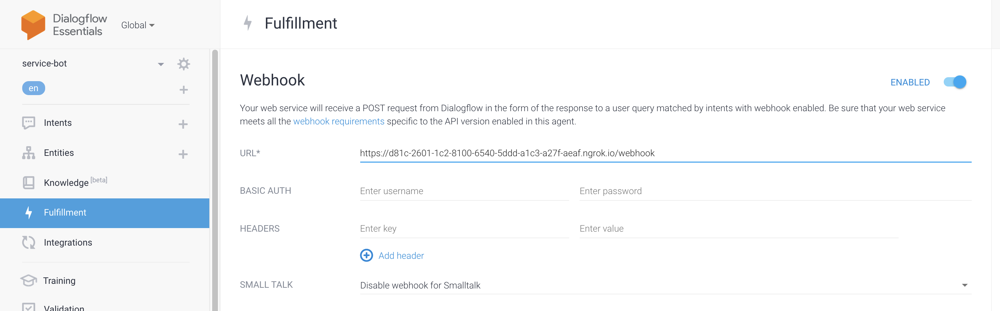

## DialogFlow Agent - Webhook Fulfillment Service 


## Project Overview
Setting up a webhook fulfillment service for a Dialogflow agent is an effective way to provide your customers with a better user experience, especially if your chatbot has an incredibly large number of intents. This repository was created to provide developers with more control over the way their Dialogflow agents behave and manage intents when dealing with various situations, such as booking appointments, rescheduling events, and remembering the name of customers that have previously interacted with the chatbot.

## Instructions
* [Create Dialogflow Agent](https://dialogflow.cloud.google.com/#/agent/)
* [Requirements](###requirements)
* [Fulfillment Service](#fulfillment-service)
* [Redis Server](#redis-server)


## Requirements
* [Create a Cloud Platform project][https://console.cloud.google.com/cloud-resource-manager]
* [Enable billing for your project][https://cloud.google.com/billing/docs/how-to/modify-project]
* [Enable the Dialogflow API][https://console.cloud.google.com/marketplace/product/google/dialogflow.googleapis.com]
* [Set up authentication with a service account][https://cloud.google.com/docs/authentication/getting-started] 

## Webhook Fulfillment Service
Node.js is an open-source, Server side platform & cross runtime environment platform which allows you to build backend and front-end applications using JavaScript.


- URL: https://552d-2620-df-8000-5701-0-2-1d46-9f26.ngrok.io/webhook
- This backend service receives POST requests from the client application in the form of the response to a user query matched by intents with webhook enabled. 
- Ensure that your web service meets all the webhook requirements specific to the API version enabled in this agent. 

### Set up an Express Server using Node.JS

```javascript

const express = require('express')
const app = express()

```

### Navigate to root directory and install the following packages:

```
$ npm install express
```
 


### Run Backend Application on Local Host:

```
$ node service.js
```

### Set up a Public URL with NGROK Tunnel:

```
$ ngrok http <port>
```
 
## Copy forwarding link from ngrok 

- For this particular service, the public endpoint was: https://d81c-2601-1c2-8100-6540-5ddd-a1c3-a27f-aeaf.ngrok.io

## Add '/webhook' to the end of your public endpoint

```javascript

    app.post('/webhook', async(request, response) => {

```

- Example: https://d81c-2601-1c2-8100-6540-5ddd-a1c3-a27f-aeaf.ngrok.io/webhook

## Enter Webhook URL in Dialogflow Agent Console:



- Navigate to https://dialogflow.cloud.google.com
- On the left side of the page, click the 'Fulfillment' tab
- In the 'Webhook' section, click 'Enable'
- Enter your public endpoint in the 'URL' field
- Click 'Save' at the bottom of the page
  - You can define when you want to send webhooks to this public endpoint in the DialogFlow console

## Create a Dialogflow Client

```javascript 

    const dialogflow = require('dialogflow');
    const sessionClient = new dialogflow.SessionsClient({
      projectId,
      credentials,
    });

```

## Project ID

Define Project ID and Session ID in Application 

- You can find your project ID in your Dialogflow Agent Settings

```javascript

    const projectId = '<project-id-here>';
    const sessionId = '<put-chat-session-id-here>';

```


## Session Management - Redis  

### Redis Server Installation
https://docs.redis.com/latest/rs/references/client_references/client_nodejs/

- To use Redis with Node.js, you need to install a Node.js Redis client. The following sections explain how to use node_redis, a community-recommended Redis client for Node.js.

- Another community-recommended client for Node.js developers is ioredis. You can find additional Node.js clients for Redis in the Node.js section of the Redis Clients page.

### Install node_redis 

```
$ npm install node_redis
```

## Connect to Redis Instance
- Run the following code in your service.js backend file to create a Redis Instance:

```javascript

const redis = require('redis');

```

## Create a new Redis Client

```javascript

const client = redis.createClient({
    socket: {
        host: '<hostname>',
        port: <port>
    },
    password: '<password>'
});

client.on('error', err => {
    console.log('Error ' + err);
});


```
https://www.sitepoint.com/using-redis-node-js/

## Install Redis Server:
- For Mac and Linux users, the Redis installation is pretty straightforward. Open your terminal and type the following commands:


```
$ wget https://download.redis.io/releases/redis-6.2.4.tar.gz
$ tar xzf redis-6.2.4.tar.gz
$ cd redis-6.2.4
$ make
```

## After the installation ends, start the server with this command:

```
$ redis-server
```

## If the previous command did not work, try the following command:

```
$ src/redis-server 
```

## Service Account Authentication
First you have to create a service account and download a .JSON format file of credentials on your local system. Now, there are three ways to use that credentials for authentication/authorisation in dialogflow library.

### Method 1
- Create an environment variable named 'GOOGLE_APPLICATION_CREDENTIALS'
- Set the value equal to the absolute path of that JSON credentials file.

```
$ export GOOGLE_APPLICATION_CREDENTIALS="<absolute-path-of-json-file>"
```

- Then, run your code. Google library will automatically load your credentials file 

### Method 2
- Assume that you know the absolute path of your JSON file and put that as value in below snippet of credentials_file_path variable.
-  You can find your project ID in your Dialogflow agent settings

```javascript

    const projectId = '<project-id-here>';
    const sessionId = '<put-chat-session-id-here>'; 
    const credentials_file_path = '<absolute-file-path-of-JSON-file>';

    // Instantiate a DialogFlow client.
    const dialogflow = require('dialogflow');

    const sessionClient = new dialogflow.SessionsClient({
      projectId,
      keyFilename: credentials_file_path,
    });

```

## Customer Onboarding

### Save the First and Last Name of Customer in Redis Cache

```javascript

    var FirstName = await parameters["first-name"]
    var LastName = await parameters["last-name"]
    try {
      const client = new Redis()
      const hashMap = {
          "FirstName": FirstName,
          "LastName": LastName
      }
      await client.hmset(session_id, hashMap)
      const sessData = await client.hgetall(session_id)
    } catch(err) {
  }

```

## Creating Appointments 

### Calculate Distance Between Two Locations Using Google Maps API:
- This feature maps the distance between a customer pickup location and a corporate business address in order to check whether the pickup distance falls within the range of 100 miles

```javascript
if (context_name == session_path + '/contexts/' + 'appointment-booking-create') {
  console.log("Calculating distance of the destination from driver location...")
  var API_KEY = process.env.DIRECTIONS_API_KEY;
  var axios = require('axios')
  var config = {
  method: 'get',
  url: `https://maps.googleapis.com/maps/api/directions/json?origin=${Origin}&destination=${Destination}&key=${API_KEY}`
  }
  axios(config).then(async function(res) {
  data = res.data
  
  distance = data["routes"][0]["legs"][0]["distance"]["text"]
  kilometers = data["routes"][0]["legs"][0]["distance"]["value"]
  console.log(`The distance between origin and destination is: ${distance}`)
  
          if (kilometers < 160394) {
              console.log("The destination is within range!")
              var jsonResponse  = {
                  "fulfillmentText" : `Perfect! I just looked up the address, it's only ${distance} away, which meets the fundraiser requirements. How many bags do you plan on selling?`
              }
              console.log("Attempting to store DestinationAddress in memory...")
              redis_client.set("DestinationAddress", Destination, function(err, response) {
                  if(err) {
                      console.log(err)
                  }
                  
              })
              console.log("Saved destination address to session cache...")
              const hashMap = {
                  "DestinationAddress": Destination 
              }
              try {
                  const client = new Redis()
                  await client.hmset(session_id, hashMap)
                  const sessData = await client.hgetall(session_id) 
                  console.log(sessData)
              } catch(err) {
                  console.log(err)
              }
          
          }
          else {
              console.log("The destination is out of range")
          
              var jsonResponse = {
                  "fulfillmentText" : "I'm so sorry, I just looked up the address on the map. It looks like that address is out of driving range, we're only allowed to book appointments that are within 100 miles of the corporate office. Would you prefer to book the appointment at a different location?"
              }
              console.log("Sent response from server to customer...")
              
          }
          response.send(jsonResponse)
  
      }).catch(function(error) {
          console.log(error)
      })
  }

```

### Validating a customer's phone number:
- This feature uses regex to validate the phone number that a customer provided to the Dialogflow agent

```javascript
  if (action == "appointment-booking-getphone") {
        const Phone = parameters["phone-number"]
        
        if (Phone.replace(/\D/g,'').length !== 10) {
            var jsonResponse = {
                "fulfillmentText": "Sorry, it looks like that phone number is invalid, could you tell me the full phone number, please?"
                }
                response.json(jsonResponse)
            
        } else {
            var jsonResponse = {
                "fulfillmentText": "Thanks! And the address of the location for the pick-up?"
                }
        try {         
            const client = new Redis()
            const hashData = { "Phone": Phone }
            await client.hmset(session_id, hashData)
            const sessData = await client.hgetall(session_id)
            redis_client.set("Phone", Phone, function(err, response) {
                if(err) {
                    console.log(err)
                }
            })
            } catch(err) {
                console.log("Error:", err)
            }      
        }
    }
```


  
